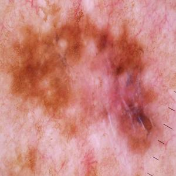
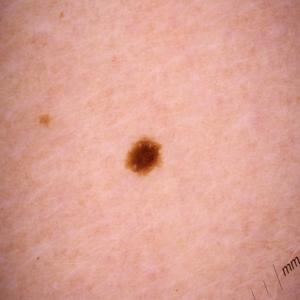

# Curso Análisis de Datos No Estructurados

## Clasificador de Melanoma (cáncer de piel - benigno vs. maligno)

Este proyecto se realiza como parte del curso de Datos No Estructurados del programa del Máster de Big Data, Tecnología y Analítica Avanzada en la Universidad Pontificia Comillas ICAI. 

El repositorio de GitLab creado para este proyecto se puede encontrar **FALTA LINK**.

### Equipo del proyecto

El equipo responsable del proyecto es el formado por los siguientes integrantes:
- Celia Quiles Alemañ | 202315604@alu.comillas.edu
- Álvaro Ezquerro Pérez | alvaroezquerro@alu.comillas.edu
- María Calvo de Mora Román | 202320059@alu.comillas.edu

### Objetivo principal

El objetivo primario de este proyecto consiste en construir un clasificador de melanoma (un tipo específico de cáncer de piel que se origina en los melanocitos, los cuales son las células que producen melanina siendo esta el pigmento que da color a la piel) utilizando técnicas de Aprendizaje Profundo, capaz de diferenciar entre melanomas malignos y benignos. Empleamos datos del dataset disponible en [Kaggle](https://www.kaggle.com/datasets/hasnainjaved/melanoma-skin-cancer-dataset-of-10000-images/data), que ha sido personalizado para construir modelos de Deep Learning que puedan clasificar esta condición médica diferenciando entre tumor maligno y benigno.

### Información general sobre el melanoma y motivación del proyecto

Tal y como se ha ocmentado, el objetivo principal del prosente proyecto es desarrollar e implementar un clasificador capaz de diferenciar entre tumor de tipo melanoma benigno y maligno. En este sentido, nos parece interesante poner en situación al lector acerca de este tipo de tumor.

El melanoma es un tipo de cáncer de piel que se origina en los melanocitos. Los melanocitos son las células productoras de melanina, pigmento que da color a la piel. 

Dicho tumor es ampliamente conocido por su demostrada gravedad y rareza. Es decir, a pesar de ser uno de los tumores de piel más raros, es sin embargo, el más peligroso de entre los distintos tipos de canceres de piel. En este sentido, una rápida y temprana detección y diagnóstico es crucial para el desarrollo de la enfermedad. Tanto es así, que dicho tumor se puede tratar con éxito el 90% de las veces si se encuentra a tiempo.

Por ello, y dado la especial relevancia en el temprano diagnóstico de esta patología, consideramos que este proyecto resulta de especial interés al proporcionar una herramienta rápida, automática y no basada en subjetividad humana visual para la clasificación de un melanoma en benigno y maligno. Esto, puede ayudar a evitar desagradables pruebas diagnósticas tales como la biopsia, permitiendo una clasificación precisa con tan solo una imagen de la zona sospechosa.

### Descripción del conjunto de datos

Para lograr dicho objetivo, el conjunto de datos consta de 10.000 imágenes de melanomas, divididas en dos clases: malignos y benignos. Para un entrenamiento eficaz y una evaluación precisa del modelo, las imágenes están distribuidas en conjuntos de entrenamiento, validación y prueba.

Por tanto, estaremos clasificando el tumor en dos clases: maligno y benigno:

- Maligno

- Benigno

De este modo, contamos con un dataset completamente balanceado con 5.000 imágenes para cada clase de tumor. Esto nos permitirá lograar un tiempo de entrenamiento razonable durante el desarrollo del proyecto, mientras que nos permitirá mantener la efectividad del modelo. El dataset original empleado y descargado de Kaggle, se divide en dos carpetas: test.zip y train.zip. Esta última carpeta del conjunto de entrenamiento contiene dos subdirectorios, cada uno correspondiente a una clase de tumor (benigno y maligno) y está accesible a través del siguiente [enlace](https://drive.google.com/drive/folders/1yC-cCbb1lM5kv0C-DmZfZZ72-FzFXly5?usp=drive_link)

### Visión general del proyecto

Nuestro proyecto se inicia con el desarrollo de una arquitectura básica de Red Neuronal Convolucional (CNN) creada desde cero, que actúa como nuestro modelo base sobre el que realizar mejoras. Este modelo inicial presentó un problema significativo de sobreajuste a los datos de entrenamiento, lo cual nos motivó a mejorar el modelo mediante un enfoque incremental. Implementamos diversas técnicas como dropout, normalización por batches y data augmentation para intentar mitigar este sobreajuste.

Posteriormente, dirigimos nuestra atención hacia el transfer learning, adoptando dos enfoques principales: la extracción de características (feature extraction) y el ajuste fino (fine-tuning) de las mismas.  En este sentido, por un lado para el feature extraction utilizamos modelos preentrenados, donde estos modelos actúan como extractores fijos (de modo que utilizamos la base de la CNN) y sus salidas alimentan a un clasificador entrenado para la nueva tarea. Por otro lado, en el ajuste fino, reactivamos las últimas capas de la parte convolucional de estos modelos y las entrenamos en conjunto con el clasificador.

Así, evaluamos y comparamos el desempeño de varios modelos preentrenados, incluyendo:

- ResNet50
- MobileNet

Finalmente, exploramos una arquitectura de red alternativa utilizando los Transformers de la librería Huggingface, buscando innovar en el campo de la clasificación de imágenes médicas.

Durante el desarrollo del proyecto, monitorizamos continuamente la precisión y la pérdida de cada modelo a lo largo de las épocas (epochs). Este seguimiento riguroso nos permite interpretar adecuadamente los resultados y extraer insights valiosos que guían nuestras decisiones de ajustes y mejoras en el modelo.

